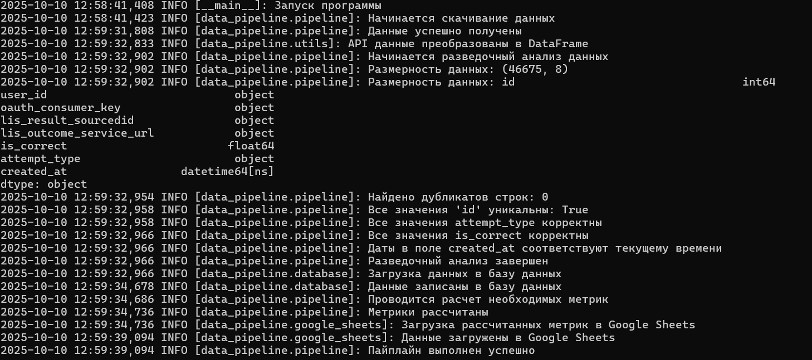

# CodeGrader Analytics — SIMULATIVE
## Описание проекта
Данный проект представляет собой автоматизированный конвейер для сбора, обработки и аналитики данных о решениях студентов, которые они отправляют через редактор кода (грейдер), интегрированный в обучающую систему онлайн-университета.   
Проект реализован на языке Python с использованием библиотек Requests, Pandas, Psycopg2, а также облачных сервисов Google (gspread, google.oauth2).
# Оглавление
1. [Цель проекта](#цель-проекта)
2. [Структура проекта](#структура-проекта)
3. [Ход выполнения](#ход-выполнения)     
    3.1. [Скачивание и обработка данных](#скачивание-и-обработка-данных)    
    3.2. [Краткий разведочный анализ данных](#краткий-разведочный-анализ-данных)   
    3.3. [Заполнение таблицы в БД](#заполнение-таблицы-в-бд)   
    3.4. [Расчет метрик](#расчет-метрик)   
    3.5. [Загрузка данных в Google Sheets](#загрузка-данных-в-google-sheets)   
    3.6. [Отправка ответа на email](#отправка-ответа-на-email)    
4. [Установка и запуск](#установка-и-запуск)
5. [Результат](#результат)


## Цель проекта
Создание эффективного ETL-конвейера для автоматизированного извлечения, трансформации и загрузки образовательных данных из системы проверки решений студентов в обучающей платформе онлайн-университета. Это позволяет консолидировать, структурировать и хранить большие объемы данных о попытках решения задач, оценках и активности студентов. В результате университет получает достоверную и своевременную информацию для аналитики прогресса обучающихся, мониторинга качества образования и улучшения образовательных методик.

## Структура проекта
```
codegrader_analytics/
├── config/
│    └── config.env
├── data_pipeline/
│    ├── database.py
│    ├── email_sender.py
│    ├── google_sheets.py
│    ├── logging_config.py
│    ├── pipeline.py
│    └── utils.py
├── main.py
└── README.md 
```
В проекте для корректной работы используется файл `config.env`, находящийся в папке `config`, в котором хранятся переменные окружения в формате ключ=значение. Этот файл содержит важные конфигурационные данные, включая секретные ключи, параметры доступа к API, базы данных и другие настройки, необходимые для запуска проекта.

Для удобства и безопасности в репозитории создаётся примерный файл `config.env.example.txt`, который содержит все необходимые ключи без реальных значений (секретов). Это помогает понять, какие именно переменные нужно заполнить для корректной работы системы, не раскрывая при этом конфиденциальную информацию.


## Ход выполнения
1. Загружаем конфигурационные параметры из файла `config.env` с помощью библиотеки `dotenv` (переменные окружения, такие как даты начала и конца обработки данных, параметры логирования, ключи доступа к API, данные для подключения к базе и настройки почты).   
2. Формируем словарь `config` с параметрами, необходимыми для работы проекта.
3. Настраиваем систему логирования, чтобы фиксировать ключевые события и ошибки в процессе работы программы. Реализация осуществляется в модуле `logging_config` в функции `setup_logging()`. В ней настраивается логирование с ротацией файлов и очисткой старых логов. Логи записываются в папку `log_dir` с именами файлов по дате __(YYYY-MM-DD.log)__, размер файла ограничен 5 МБ, хранится до 3 резервных копий.
4. Создаем объект `DataPipeline` с конфигурацией, который отвечает за основной процесс извлечения, обработки и загрузки данных.

### Скачивание и обработка данных
Данный класс `DataPipeline` инкапсулирует логику скачивания, обработки, анализа и загрузки данных для проекта. Класс реализован в модуле `pipeline.py`
1. Вызывается метод `fetch_data()`, который отвечает за отправку HTTP-запроса на внешний API с параметрами из конфигурации, получает и возвращает сырые данные в формате JSON.
```python
self.logger.info("Начинается скачивание данных")
params = {
    'client': self.config['client'],
    'client_key': self.config['client_key'],
    'start': parse_date(self.config['start_date']),
    'end': parse_date(self.config['end_date']),
}
response = requests.get(self.config['api_url'], params=params)
response.raise_for_status()
self.logger.info("Данные успешно получены")
```
2. Метод `process_data()` преобразует сырые данные из JSON в структурированный DataFrame Pandas, переименовывает и реорганизует колонки.  
```python
df = flatten_api_data(raw_json)
df['created_at'] = df['created_at'].astype('datetime64[ns]')
# переименование колонок
df.columns = ['user_id', 'is_correct', 'attempt_type', 'created_at',
    'oauth_consumer_key', 'lis_result_sourcedid',
    'lis_outcome_service_url']
# изменение структуры датафрейма (меняем колонки местами)
df = df[['user_id', 'oauth_consumer_key', 'lis_result_sourcedid', 'lis_outcome_service_url',
    'is_correct', 'attempt_type',
    'created_at']]
df = df.reset_index(names = 'id')
print(df)
```
__Полученные результаты__

| id | user_id                          | oauth_consumer_key | ... | is_correct | attempt_type | created_at                 |
|----|---------------------------------|--------------------|-----|------------|--------------|----------------------------|
| 0  | d0aa33caaa564d569b05e4a360ca8ec9 | ...                | ... | NaN        | run          | 2023-04-01 00:01:06.590200 |
| 1  | d0aa33caaa564d569b05e4a360ca8ec9 | ...                | ... | NaN        | run          | 2023-04-01 00:01:21.836076 |
| 2  | d0aa33caaa564d569b05e4a360ca8ec9 | ...                | ... | NaN        | run          | 2023-04-01 00:02:11.257519 |
| 3  | d0aa33caaa564d569b05e4a360ca8ec9 | ...                | ... | NaN        | run          | 2023-04-01 00:02:29.162716 |
| 4  | 587f834ad502642076c4cd3bde024c37 | ...                | ... | NaN        | run          | 2023-04-01 00:03:12.718549 |
| 5  | d0aa33caaa564d569b05e4a360ca8ec9 | ...                | ... | NaN        | run          | 2023-04-01 00:03:26.690852 |

### Краткий разведочный анализ данных
В методе `process_data()` также реализовано выполнение разведочного анализа данных 
```python
self.logger.info("Начинается разведочный анализ данных")
# Размерность
shape_df = df.shape
self.logger.info(f"Размерность данных: {shape_df}")

#INFO [data_pipeline.pipeline]: Размерность данных: (46675, 8)
```
```python
# Проверка дубликатов по всем колонкам
duplicates = df.duplicated().sum()
self.logger.info(f"Найдено дубликатов строк: {duplicates}")

#INFO [data_pipeline.pipeline]: Найдено дубликатов строк: 0
```
```python
# Проверка уникальности id (индекса)
unique_ids = df['id'].is_unique
self.logger.info(f"Все значения 'id' уникальны: {unique_ids}")

#INFO [data_pipeline.pipeline]: Все значения 'id' уникальны: True
```

```python
# Проверка допустимых значений в attempt_type (пример значений)
valid_attempt_types = {'submit', 'run', 'test'}  # заменить на реальные допустимые значения
invalid_attempt_types = df.loc[~df['attempt_type'].isin(valid_attempt_types), 'attempt_type'].unique()
if len(invalid_attempt_types) > 0:
    self.logger.warning(f"Обнаружены недопустимые значения в attempt_type: {invalid_attempt_types}")
else:
    self.logger.info("Все значения attempt_type корректны")

#INFO [data_pipeline.pipeline]: Все значения attempt_type корректны
```
```python
# Проверка диапазона is_correct
invalid_is_correct = df.loc[(~df['is_correct'].isin([0.0, 1.0])) & (df['is_correct'].notna()), 'is_correct'].unique()
if len(invalid_is_correct) > 0:
    self.logger.warning(f"Обнаружены недопустимые значения в is_correct: {invalid_is_correct}")
else:
    self.logger.info("Все значения is_correct корректны")

#INFO [data_pipeline.pipeline]: Все значения is_correct корректны
```
```python
# Проверка диапазонов дат (например, нет будущих дат)
max_date = df['created_at'].max()
if max_date > pd.Timestamp.now():
    self.logger.warning(f"Обнаружена дата в будущем: {max_date}")
else:
    self.logger.info("Даты в поле created_at соответствуют текущему времени")

#INFO [data_pipeline.pipeline]: Даты в поле created_at соответствуют текущему времени
```
Проведенный разведочный анализ говорит о том, что данные чистые, корректные и готовы для дальнейшего анализа или моделирования.
### Заполнение таблицы в БД
После того, как разведочный анализ проведен происходит загрузка данных в базу данных. В модуле `database.py` создан класс `DatabaseUploader`, который отвечает за загрузку данных из Pandas DataFrame в базу данных PostgreSQL с использованием библиотеки `psycopg2`.
1. Устанавливается соединение с базой данных с помощью параметров из конфигурации (self.db_params).
```python
conn = psycopg2.connect(**self.db_params)
cursor = conn.cursor()
```
2. Создаётся или проверяется существование таблицы user_config с заданными колонками и типами.
```python
cursor.execute('''
    CREATE TABLE IF NOT EXISTS user_config (
        id SERIAL PRIMARY KEY,
        user_id TEXT,
        oauth_consumer_key TEXT,
        lis_result_sourcedid TEXT,
        lis_outcome_service_url TEXT,
        is_correct REAL,
        attempt_type TEXT,
        created_at TIMESTAMP
    )
''')
conn.commit()
```
3. Преобразует строки DataFrame в кортежи для удобной массовой вставки.
```python
data_tuples = [tuple(row) for row in df.to_numpy()]
```
4. Используется функцию `execute_values` из `psycopg2` для эффективной пакетной вставки данных с поддержкой обновления записей по ключу `id` через `ON CONFLICT`.
```python
insert_query = '''
    INSERT INTO user_config (
        id, user_id, oauth_consumer_key, lis_result_sourcedid, lis_outcome_service_url,
        is_correct, attempt_type, created_at
    ) VALUES %s
    ON CONFLICT (id) DO UPDATE SET
        user_id=EXCLUDED.user_id,
        oauth_consumer_key=EXCLUDED.oauth_consumer_key,
        lis_result_sourcedid=EXCLUDED.lis_result_sourcedid,
        lis_outcome_service_url=EXCLUDED.lis_outcome_service_url,
        is_correct=EXCLUDED.is_correct,
        attempt_type=EXCLUDED.attempt_type,
        created_at=EXCLUDED.created_at
'''
execute_values(cursor, insert_query, data_tuples)
```
Транзакция фиксируется коомитом, курсор и соединение закрываются
Фиксирует транзакцию коммитом.
```python
conn.commit()
cursor.close()
conn.close()
```
### Расчет метрик
В классе `DataPipeline` реализован метод `calculate_metrics()`, который рассчитывает ключевые метрики по дням.
1. Количество попыток совершенных за день
```python
total_attempts_per_day = df.groupby(df['created_at'].dt.date).size()
```
2. Количество успешных попыток в день
```python
successful_attempts_per_day = df[df['is_correct'] == 1.0].groupby(df['created_at'].dt.date).size()
```
3. Количество уникальных пользователей в день
```python
unique_users_per_day = df.groupby(df['created_at'].dt.date)['user_id'].nunique()
```
Затем создается DataFrame `summary_df`, в который записываются рассчитанные метрики
```python
summary_df = total_attempts_per_day.to_frame(name='Всего попыток')
summary_df['Успешных попыток'] = successful_attempts_per_day.reindex(summary_df.index, fill_value=0)
summary_df['Уникальных пользователей'] = unique_users_per_day.reindex(summary_df.index, fill_value=0)
summary_df.reset_index(inplace=True)
summary_df.rename(columns={'created_at': 'Дата'}, inplace=True)
```
### Загрузка данных в Google Sheets
Теперь когда все метрики рассчитаны, они загружаются в таблицу Google Sheets. Класс `GoogleSheetsUploader` в модуле `google_sheets.py` реализует функцию загрузки данных из Pandas DataFrame в Google Sheets с использованием API Google Sheets и библиотеки gspread с дополнением `gspread_dataframe`.   
1. В методе `__init__` происходит аутентификация и подключение к Google Sheets API с использованием сервисного аккаунта Google.
Вызов Credentials.from_service_account_file() для загрузки учетных данных из файла — это использование секретных данных. Этот файл содержит ключи доступа, которые предоставляют полный или ограниченный доступ к ресурсам Google Cloud. Для того чтобы программа выполнялась, необходимо создать JSON-файл с ключами доступа для Google Cloud.
```python
def __init__(self, config):
        self.logger = logging.getLogger(__name__)
        scopes = ['https://www.googleapis.com/auth/spreadsheets', 'https://www.googleapis.com/auth/drive']
        self.creds = Credentials.from_service_account_file(config['service_account_file'], scopes=scopes)
        self.client = gspread.authorize(self.creds)
        self.spreadsheet_id = config['spreadsheet_id']
```
2. В методе `upload` получаем доступ к Google Sheets с помощью сервисного аккаунта и OAuth2, используя путь из конфигурации и открываем таблицу по ключу `spreadsheet_id`.
```python
spreadsheet = self.client.open_by_key(self.spreadsheet_id)
spreadsheet = self.client.open_by_key(self.spreadsheet_id)
```
3. Получаем лист с именем 'RawData' и очищаем лист, чтобы загрузить новые данные без старых.
```python
worksheet = spreadsheet.worksheet('RawData')
worksheet.clear()
```
4. Используем функцию `gspread_dataframe.set_with_dataframe` для записи DataFrame в лист.
```python
gd.set_with_dataframe(worksheet, summary_df)
```
### Отправка ответа на email
Класс `EmailSender` в модуле `email_sender.py` организует отправку электронных писем через SMTP-сервер с использованием встроенной библиотеки Python `smtplib` и класса EmailMessage из модуля `email.message`.
1. Создаём объект сообщения `EmailMessage`, в который добавляется тело письма, тема, адрес отправителя и получателя из конфигурации.
```python
msg = EmailMessage()
msg.set_content(self.config['email_body'])
msg['Subject'] = self.config['email_subject']
msg['From'] = self.config['sender_email']
msg['To'] = self.config['receiver_email']
```
2. Создаём защищённый SSL-контекст `ssl.create_default_context()` для безопасного соединения с SMTP-сервером.
```python
context = ssl.create_default_context()
```
3. В блоке `with smtplib.SMTP_SSL(...) as server:` устанавливаем SSL-соединение с SMTP-сервером по указанному адресу и порту. 
```python
with smtplib.SMTP_SSL(self.config['smtp_server'], self.config['smtp_port'], context=context) as server:
```
4. Выполняем логин на сервер с помощью логина и пароля отправителя.
Отправляем письмо методом `send_message(msg)`.
```python
server.login(self.config['sender_email'], self.config['email_password'])
server.send_message(msg)
```
## Установка и запуск
1. Клонируйте репозиторий
2. Укажите необходимые значения в файле `config.env` в соответствующих переменных.
3. Запустите главный скрипт: `python main.py`

## Результат

