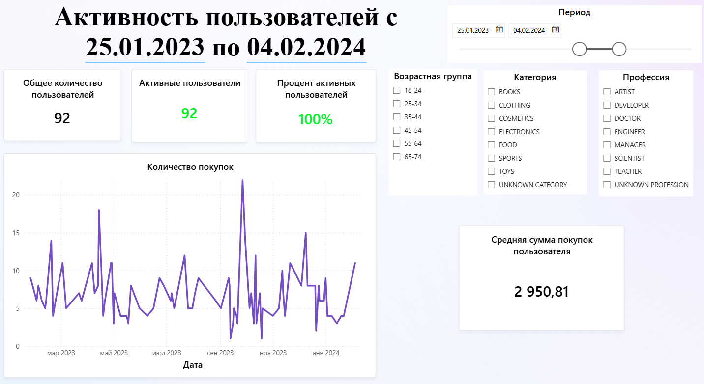

# Дашборд Анализа Пользователей и Покупок (Power BI)

Для построения визуализаций использовались синтетически сгенерированные данные о пользователях и покупках, загруженные из локальной БД.

# Оглавление
1. [Описание проекта](#описание-проекта)    
2. [Основные блоки дашборда](#основные-блоки-дашборда)    
    2.1. [Демография пользователей](#демография-пользователей)    
    2.2. [Активность и поведение пользователей](#активность-и-поведение-пользователей)    
    2.3. [Анализ покупок](#анализ-покупок)    
4. [Технологии и инструменты](#технологии-и-инструменты)

## Описание проекта
Данный дашборд создан в Power BI для комплексного анализа пользователей маркетплейса и их покупок. Включает в себя основные метрики, визуализации и сегментацию для глубокого понимания поведения пользователей и динамики продаж.

## Основные блоки дашборда

### Демография пользователей
- **Гистограмма распределения возрастов** — анализ возрастных групп пользователей.
- **Круговая диаграмма по профессиям** — распределение пользователей по профессиональным категориям.
- **Временной график присоединения новых пользователей** — динамика прироста базы.

### Активность и поведение пользователей
- **Kарточки с общим количеством пользователей, активных пользователей и процентом тех, кто совершил покупку** — ключевые показатели вовлеченности.
- **Средняя сумма покупок на пользователя** — средний чек, отражающий покупательскую активность.
- **Сегментация пользователей по возрасту и профессии с возможностью фильтрации** — интерактивный анализ сегментов аудитории.

### Анализ покупок
- **Общая и средняя сумма покупок с фильтрацией по времени** — анализ выручки и средней стоимости заказов.
- **Распределение по категориям покупок** — визуализация популярных категорий с помощью круговых диаграмм.
- **ТОП-3 покупателей по сумме покупок** — выявление ключевых клиентов по объему покупок.
<<<<<<< HEAD

## Как использовать
1. Скачайте и откройте файл дашборда в Power BI Desktop. [marketplace_users.pbix](./marketplace_users.pbix)
2. При необходимости обновите источники данных.
3. Используйте срезы по времени, возрасту, профессиям для интерактивного анализа.
=======

>>>>>>> 20e5c97 (Обновление README.md)

## Технологии и инструменты
- Power BI Desktop
- DAX для вычисляемых мер и комплексных формул
- Визуальные элементы: Гистограммы, Круговые диаграммы, Линейные графики, Карточки
