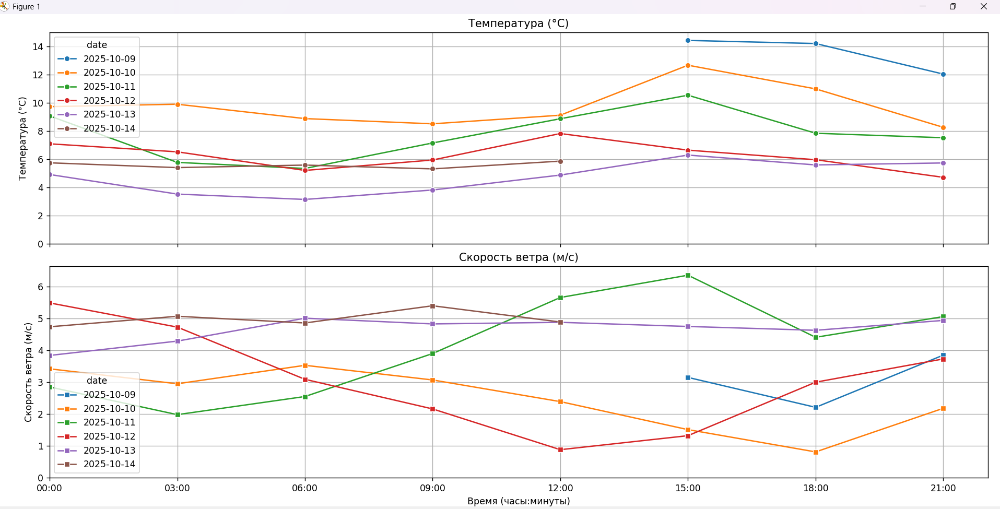

# Получение прогноза погоды на 5 дней с интервалами 3 часа
## Описание проекта
Данный проект представляет собой анализ и визуализацию прогноза погоды для Санкт-Петербурга на 5 дней с интервалом 3 часа, полученного с помощью OpenWeatherMap API, реализованный на языке Python с использованием библиотек Requests, Pandas, Seaborn и Matplotlib.
# Оглавление
1. [Цель проекта](#цель-проекта)
2. [Структура проекта](#структура-проекта)
3. [Ход выполнения](#ход-выполнения)    
    3.1. [main.py](#mainpy)    
    3.2. [weather-api.py](#weather-apipy])    
    3.3. [visualization.py](#visualizationpy])
4. [Установка и запуск](#установка-и-запуск)
5. [Результат](#результат)


#### Цель проекта
Получение и анализ прогноза погоды для Санкт-Петербурга на 5 дней с интервалом в 3 часа, используя API OpenWeatherMap. Проект позволяет собрать подробные данные о температуре и скорости ветра с разбором по времени для каждого трёхчасового периода, что даёт полное представление о динамике погодных условий в городе в течение нескольких дней.   
Задачей этого проетка является повышение доступности и удобство работы с погодными данными, позволяя использовать их для прогнозов, анализа и принятия решений на основе точных, регулярно обновляемых данных.

### Структура проекта
```
weather_forecast_project/
│
├── config.env               # Файл с переменной API_KEY (ключ OpenWeatherMap)
├── main.py                  # Главный исполняемый скрипт
├── requirements.txt         # Зависимости проекта
├── README.md                # Описание проекта, инструкции по запуску
└── utils/                   # Вспомогательные модули
    ├── weather_api.py       # Функции для запроса и обработки данных с API
    └──  visualization.py     # Функция построения графиков
```

Файл `requirements.txt` создан для указания зависимостей (библиотек и их версий), необходимых для работы Python-проекта. Он содержит список пакетов, которые нужно установить, чтобы проект корректно работал. 

В файле `config.env` хранятся переменные окружения в формате ключ=значение, которые содержат конфигурационные данные проекта (в  нашем случае там хранится секретный API-ключ)

### Ход выполнения
#### main.py
Для корректной работы программы необходимо импортировать библиотеки
```python
from pathlib import Path
from dotenv import load_dotenv
import os
from utils.weather_api import get_weather_data, process_weather_data
from utils.visualization import plot_weather
```
Помимо стандартных библиотек Python были импортированы модули `weather_api` и `visualization`, содержащие в себе функции для запроса и обработки данных с API и функции для построения графиков.

Далее происходит загрузка ключа API из файла конфигурации `config.env`. Сам файл загружается в программу через библиотеку `python-dotenv`, и переменные из него становятся доступны через `os.getenv()`

```python
    base_dir = Path.cwd()
    dotenv_path = base_dir / 'config.env'
    load_dotenv(dotenv_path=dotenv_path)
    # загрузка ключа API из файла конфигурации
    api_key = os.getenv('API_KEY')
    # проверка наличие API ключа
    if not api_key:
        print("Ошибка: Не найден API ключ в config.env")
        return
```
Затем запрашиваются и обрабатываются данные о погоде в Санкт-Петербурге при помощи соответствующих функций `get_weather_data()`  и `process_weather_data()` из модуля [weather_api.py](#weather_apipy).  
И далее в функции `plot_weather()` в модуле [vizualization.py](#vizualizationpy) происходит визуализация данных

```python
data = get_weather_data(lat, lon, api_key)
    if data:
        weather_info = process_weather_data(data)
        plot_weather(weather_info)
```

#### weather_api.py
В  функции `get_weather_data()` происходит запрос данных о погоде с использованием OpenWeatherMap API.
1. Формируем URL запроса к API для прогноза погоды на 5 дней с интервалом времени 3 часа.
```python
 url = 'https://api.openweathermap.org/data/2.5/forecast'
```
2. В словаре params задаем параметры запроса: координаты (широта, долгота), ключ API, язык ответа (русский), единицы измерения (цельсии).
```python
params = {
    'lat': lat,
    'lon': lon,
    'appid': api_key,
    'lang': 'ru',
    'units': 'metric'
}
```
3. Функция отправляет GET-запрос requests.get с этими параметрами. При успешной отправке запроса возвращается ответ в формате JSON. При неудачной попытке - выводится сообщение и функция возвращает `None`
```python
try:
    response = requests.get(url, params=params)
    response.raise_for_status()
    return response.json()
except requests.exceptions.RequestException as e:
    print(f"Ошибка запроса к API: {e}")
    return None
```
Если запрос отправлен успешно, и мы получили данные, происходит процесс обработки этих данных в функции `process_weather_data()`. Она принимает сырые данные прогноза погоды из API (в формате JSON) и преобразует их в удобный для анализа Pandas DataFrame.
1. Сначала из списка прогнозов `data['list']` извлекаем временную метку Unix `dt`, температуру `temp` и скорость ветра `wind_sp`. Временные метки Unix преобразуются в человекочитаемые строки формата YYYY-MM-DD HH:MM:SS.
```python
dt = [item['dt'] for item in data['list']]
time_f = [datetime.datetime.fromtimestamp(t).strftime('%Y-%m-%d %H:%M:%S') for t in dt] #преобразование в читаемую дату
temp = [item['main']['temp'] for item in data['list']]
wind_sp = [item['wind']['speed'] for item in data['list']]
```
2. Создаём DataFrame с колонками даты-времени (dt), температуры и скорости ветра.
```python
weather_info = pd.DataFrame({
    'dt': pd.to_datetime(time_f),
    'temp': temp,
    'speed_wind_s': wind_sp
})
```

3. Добавляем дополнительные колонки:
`date` — только дата без времени,
`time` — только время в виде строки.
```python
weather_info['date'] = weather_info['dt'].dt.date
weather_info['time'] = weather_info['dt'].dt.time.astype(str)

```

4. Рассчитываем время, прошедшее с полуночи для каждой временной точки, в секундах (time_seconds) — это понадобится для удобной визуализации по времени суток.
```python
weather_info['time_since_midnight'] = weather_info['dt'].dt.floor('D') #округления datetime-значений вниз до начала суток
weather_info['time_since_midnight'] = weather_info['dt'] - weather_info['time_since_midnight'] #вычисляем сколько времени прошло с полуночи для каждой записи
weather_info['time_seconds'] = weather_info['time_since_midnight'].dt.total_seconds() #переводим полученное время в секунды

```
В итоге, функция возвращает структурированную таблицу с колонками, удобными для анализа и построения графиков по времени, температуре и ветру.
#### vizualization.py
Для того, чтобы визуально отобразить полученные данные функция `plot_weather()` создает два графика с использованием библиотеки __Seaborn__ (*для удобного построения*) и __Matplotlib__ (*для настройки осей и отображения*).
1. Для каждого графика строится линейный график с осью X — секунды с начала суток, осью Y — температура или скорость ветра.  

Ниже представлен код для графика зависимости температуры от времени. Для графика зависимости скорости ветра от времени код аналогичный.

```python
# график зависимости температуры от времени
sns.lineplot(data=weather_info, x='time_seconds', y='temp', hue='date', ax=ax1, marker='o')
# наименование оси Y
ax1.set_ylabel('Температура (°C)')
# заголовок подграфика
ax1.set_title('Температура (°C)')
```
2. Устанавливаем расположение основных делений (тикеров) на оси X с интервалом в 3600 единиц. В нашем случае ось X измеряется в секундах, поэтому деления будут через каждые 3600 секунд, то есть через каждый полный час.
```python
ax1.xaxis.set_major_locator(ticker.MultipleLocator(3600))
```
3. Функция `seconds_to_time` переводит секунды в формат "часы:минуты" (например, 7200 → "02:00").
```python
ax1.xaxis.set_major_formatter(ticker.FuncFormatter(seconds_to_time))
```
4. Для удобства восприятия метки по оси X выделяем каждые 3 часа.
```python
tick_positions = [i * 3600 for i in range(0, 24, 3)]
tick_labels = [f'{i:02d}:00' for i in range(0, 24, 3)]
```

В конце вызываем `plt.show()` для отображения графиков.

### Установка и запуск

1. Клонируйте репозиторий
2. Установите зависимости: `pip install -r requirements.txt`
3. Укажите API ключ в файле `config.env` в переменной `API_KEY`.
4. Запустите главный скрипт: `python main.py`

### Результат


